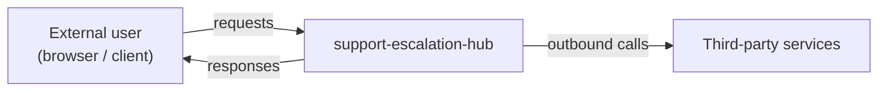
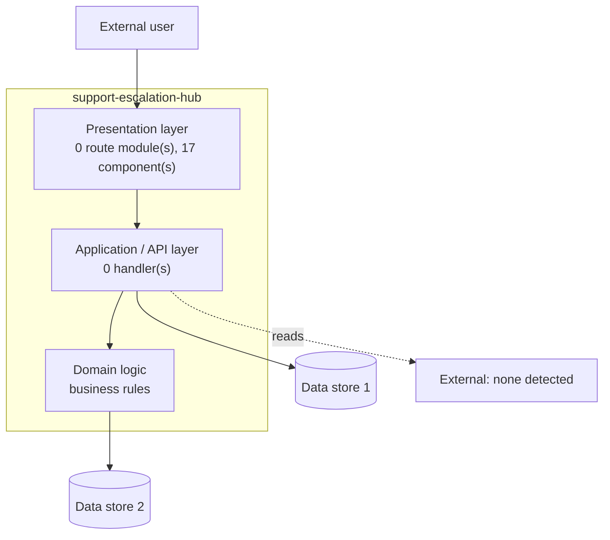

# support-escalation-hub — Data Flow Diagram

> Generated from static analysis on 2026-09-28. The diagram shows processes and
> stores that were **positively detected**. Dashed nodes are inferred from a
> dependency and were not traced through the code — verify before relying on them.

## Context diagram (level 0)

## Level-0 decomposition

## Data stores

| Store | Evidence | Status |
| --- | --- | --- |
| @supabase/supabase-js | declared in dependency manifest | inferred — verify |

## External integrations

| Integration | Direction | Evidence |
| --- | --- | --- |

| *(none detected)* | — | no outbound client library found |

## Data classification

| Data class | Present | Notes |
| --- | --- | --- |
| Public content | unclear | served pages |
| User account data | not detected | no auth library detected — confirm whether accounts exist |
| Personal / sensitive data | `[TO BE CLASSIFIED]` | cannot be determined statically |
| Credentials / secrets | yes, by design | environment variables only, never in source |
| Payment data | not detected | |
